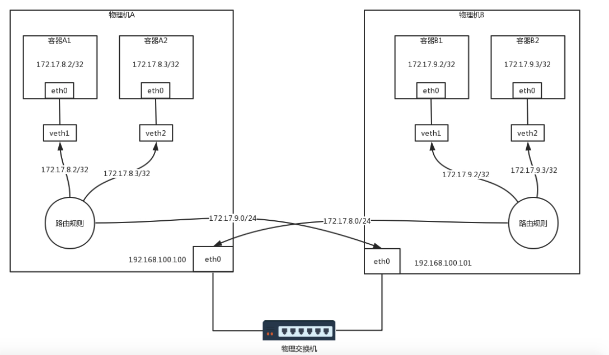

##### docker 网络
- docker 服务启动后，会在宿主机创建一个网桥 `docker0`
- docker 容器和 `docker0` 网桥两端会创建一对虚拟网卡 `veth`， 称为 `veth pair`， 从而实现`容器与宿主机间的通信`
- 因为每个 docker 容器的虚拟网卡 `veth` 都连接在 `docker0` 网桥上，所以实现了 `同一宿主机上的容器间的通信` 

#### 容器间网络 Flannel


物理机间的容器网络通信需要使用 Overlay 网络模型。  
Flannel 是跨节点容器网络方案之一，它提供的 Overlay 方案有两种方式：

- 使用 UDP 在用户态封装数据包
- 使用 VXLAN 在内核态封装，性能相对较好

#### 跨主机容器通信 Calico
Calico 网络模型依赖三层网络的路由转发， 将主机当做路由器，找到下一跳的地址，依次找下去，就可以与目标容器通信。 因为全程没有像 Flannel 一样的隧道封装解封过程，
而仅仅是单纯的路由转发，所以性能会比 Flannel 大大提升。 

  

说明： 
1. 容器`A1`的IP地址为 `172.17.8.2/32`，这样就将容器A1作为一个单点的局域网了，在此容器中设置路由：
```
default via 169.254.1.1 dev eth0 
169.254.1.1 dev eth0 scope link 
```
IP `169.254.1.1` 是默认网关，但实际上并不存在这样一个 IP 地址。因为一台机器要访问网关的时候，首先会通过ARP获得网关的MAC地址，然后将目标MAC变为网关的MAC，而网关的IP地址不会在任何网络包头里面出现，也就是说，没有人在乎这个地址具体是什么，只要能找到对应的MAC，响应ARP就可以了。
所以 Calico 会在本地 ARP 缓存中存入一条数据： 
```
169.254.1.1 dev eth0 lladdr ee:ee:ee:ee:ee:ee STALE
```
物理机A上查看所有网卡的MAC地址的时候，会发现veth1就是这个MAC地址，这样容器 A1 里发出的网络包，第一跳是 veth1 这个网卡，也就到达了物理机A  。  

在 `物理机A` 上设置路由：  

```
172.17.8.2 dev veth1 scope link 
172.17.8.3 dev veth2 scope link 
172.17.9.0/24 via 192.168.100.101 dev eth0 proto bird onlink
```
前两行表示去两个本机容器的路由，用于容器A1，A2 接收网络包。  
第三行表示访问 `172.17.9.0/24` 网段要通过 IP 为 `192.168.100.101` 的网卡 eth0， 这样就可以将网络包发送到对方主机。

在 `物理机B` 上设置路由：
```
172.17.9.2 dev veth1 scope link 
172.17.9.3 dev veth2 scope link 
172.17.8.0/24 via 192.168.100.100 dev eth0 proto bird onlink
```
与物理机A相似  
前两行表示去访问本地容器的路由，第三行表示访问网段为 `172.17.8.0/24` 要通过 IP 为`192.168.100.100`的物理机A

##### 架构
 - 路由配置组件 Felix： 在物理机上负责配置路由的组件
 - 路由广播组件BGP Speaker： 广播路由信息， 没当有路由变化，就要通知集群中的所有机器
 - 安全策略组件：使用 iptables 实现的，将策略嵌入处理点

 

##### BGP全连接的复杂性
引入 BGP Router Reflector 解决

##### 跨网段访问问题
假设物理机B的ip为192.168.200.101/24， 不再同一网段。  
使用 IPIP 模式。  

在物理机A和物理机B之间打一个隧道，这个隧道有两个端点，在端点上进行封装，
将容器的IP作为乘客协议放在隧道里面，而物理主机的IP放在外面作为承载协议。
这样不管外层的IP通过传统的物理网络，走多少跳到达目标物理机，从隧道两端看起来，
物理机A的下一跳就是物理机B，这样前面的逻辑才能成立。  

IPIP 模式下物理机A的路由：
```
172.17.8.2 dev veth1 scope link 
172.17.8.3 dev veth2 scope link 
172.17.9.0/24 via 192.168.200.101 dev tun0 proto bird onlink
```
可以发现：
- 发出去的网络包下一跳不再是同一网段的物理机B，而是 IP 为 192.168.200.101
- 转发到隧道端点 `tun0` 封装内层源ip目标ip和外层源ip目标后，才会转发到 eth0。
- 网络包使用外层源ip和目标ip 通过 eth0 进行转发路由，直到到达物理机 B，
- 物理机 B 上的 tun0 会对网络包解封，找到内源ip和目标ip，从而可以转发给相应的容器


