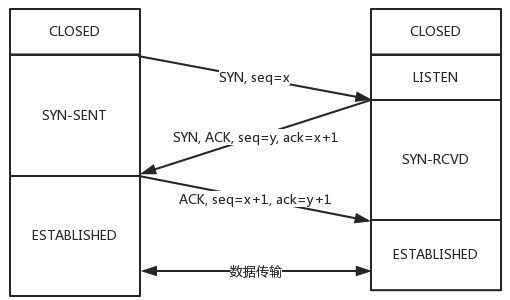
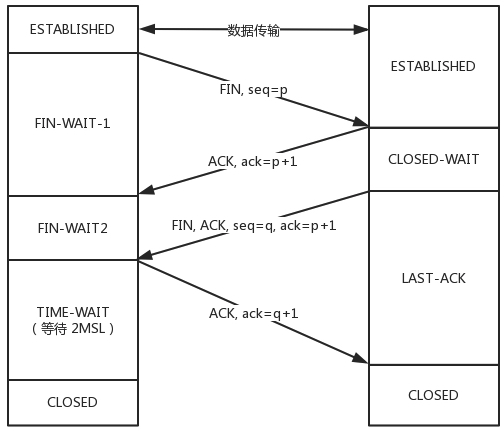
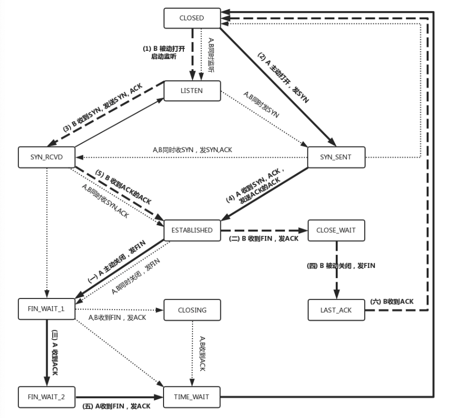
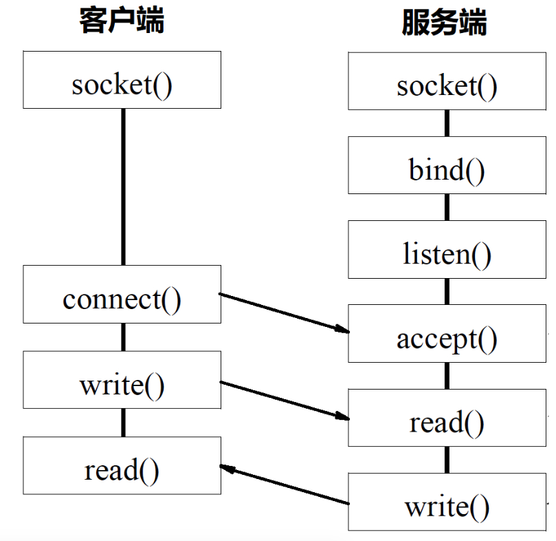
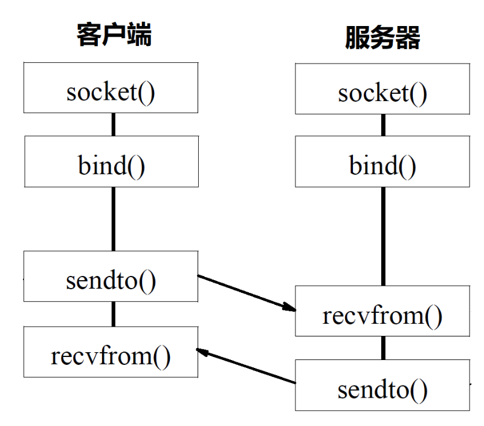

### tcp 和 udp 的区别

 -| TCP | UDP |
---|--- | --- |
连接| 互通前需要建立连接| 不需要
可靠性 | 保证可靠，无差错，不重复，按序到达| 不保证
数据类型 | 将ip包封住为字节流式，基于字节流 | 保持IP 包的特性，基于数据报
拥塞控制 | 是 | 否
有状态 | 是 | 否

### UDP

MAC层定义了本地局域网的传输行为，
IP层定义了整个网络端到端的传输行为，
这两层基本定义了这样的基因：网络传输
是以包为单位的，二层叫帧，网络层叫包，
传输层叫段。我们笼统地称为包。包单独传输，
自行选路，在不同的设备封装解封装，不保证到达。
UDP完全继承了这些特性。

UDP 包头只有源端口号和目标端口号。   

UDP 适用场景：
- 网络情况比较好的，对于丢包不敏感，比如内网
- 广播, 组播， 比如 DHCP
- 要求速度快，由应用端实现自己的连接策略，可靠保证

应用举例： 
- QUIC (Quick UDP Internet Connections，快速UDP互联网连接)
- 直播业务用的流媒体协议
- 实时游戏
- IOT 物联网
-  在4G网络里，移动流量上网的数据面对的协议GTP-U是基于UDP的

### TCP
  

- 序号(32位)： 解决乱序问题
- 确认序号(32位): 解决丢包问题, 累计确认，累计应答
- 状态位： SYN(发起连接),ACK(回复),RST(重新连接),FIN(结束连接)， 维护连接两端的状态
- 窗口大小：标识自己的处理能力，连接双端通过窗口大小做流量控制，拥塞控制

#### 三次握手四次挥手
三次握手

四次挥手  

状态机：  

#### socket 编程
##### tcp

##### udp

#### 系统处理大量socket请求的方式
##### 多进程
为每个请求 fork 一个进程，由该进程处理请求对应的 socket

##### 多线程

为每一个请求 fork 一个线程，由该线程处理请求对应的 socket。  
相比进程，线程要更轻量级。

##### 以轮询的方式由一个线程处理多个 socket
一个线程维护一个 fd_set， 其中就是多个 socket 对应的文件描述符。通过调用 select 轮询的方式找出
socket 中发生变化的进程处理。

##### 以事件的方式由一个线程处理多个 socket
上述 select 轮询的方式很低效，如果用事件通知的方式，每次 socket 发生变化，主动向 epoll 对应通知处理。  

epoll 是解决 C10K 问题的基础。  

- select 需要在用户空间和内核空间之间传递 fd_set;
- epoll 由内核维护一个红黑树管理文件描述符
##### 更多

