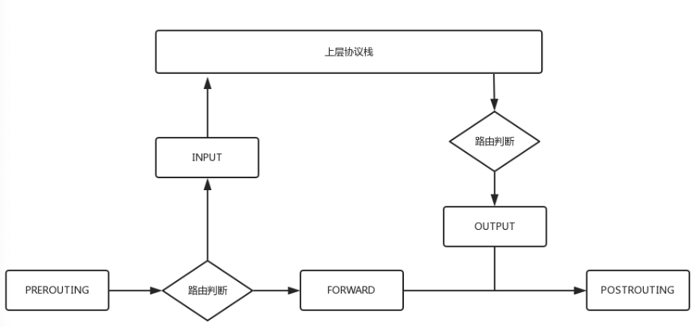
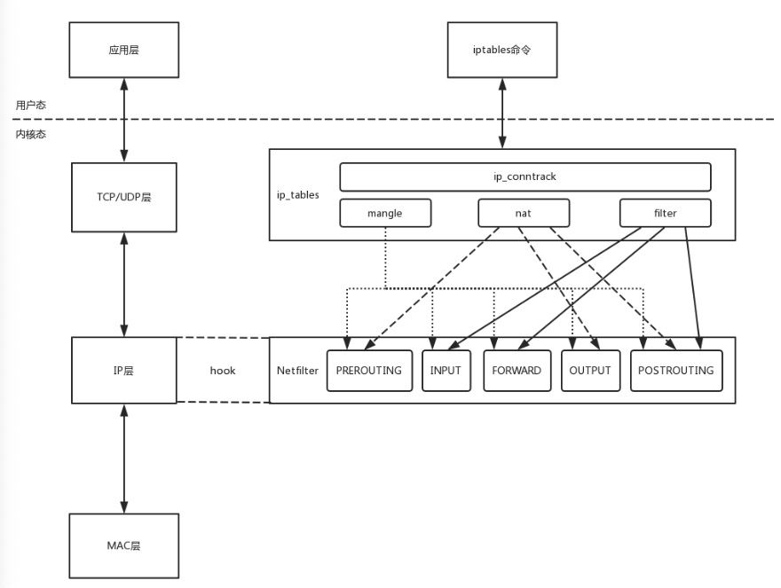
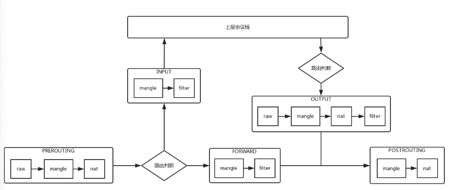

### TCP/IP 处理请求包的五个过程节点


- PREROUTING: 网络层拿到 目标IP 后会进行路由判断，再次之前的过程称为 PREROUTING
- INPUT： 如果目标IP就是本机IP，就将包发给传输层处理，这个过程称为 INPUT
- FORWARD: 如果目标IP不是本机IP， 就将包转发出去，这个过程称为 FORWARD
- OUTPUT: 传输层处理完包后，会将处理结果发出去，这个过程称为 OUTPUT
- POSTROUTING： 经过 FORWARD 或 OUTPUT 后的过程称为 POSTROUTING


### Netfilter
这是 linux 内核中的一个框架，它可以在上述的 5 个过程节点上插入 hook 函数，对数据包进行操作。
- ACCEPT: 接受请求
- DROP： 拒绝请求
- QUEUE： 将请求交给用户态进程处理

### ip_tables
ip_tables 就是对 Netfilter 框架的实现，它的功能可以分为 4 类：  

- 连接跟踪（conntrack), 基础功能，被其它三个功能依赖 
- 数据包的过滤（filter）
- 网络地址转换（nat）
- 和数据包的修改（mangle）

我们常用的 `iptables` 是修改内核 `ip_tables` 规则的命令行工具： 



#### iptables 的四表五链
四表：raw–>mangle–>nat–>filter, 按优先级排序，每一种表都代表一种功能  
五链: PREROUTING, INPUT，FORWARD，OUTPUT，POSTROUTING， 每个链上都可以有多个表的操作

##### mangle 表
在任何链上都生效，用于修改数据包
##### nat 表

用于处理网络地址转换，可以改变数据包的源地址和目标地址 

- PREROUTING 链: 在数据包到达防火墙时改变`目标地址`
- OUTPUT 链: 改变本地产生的数据包的`目标地址`
- POSTROUTING 链：在数据包离开防火墙时改变数据包的`源地址`

##### filter 表
- INPUT 链： 过滤所有目标地址是本机的数据包
- FORWARD 链: 过滤所有路过本机的数据包
- OUTPUT 链: 过滤所有由本机产生的数据包

#### iptable 总览


#### iptables 命令行示例
```shell script
# 拒绝所有请求
iptables -t filter -A INPUT -s 0.0.0.0/0.0.0.0 -d X.X.X.X -j DROP

# 允许 shh 请求
iptables -A INPUT -s 0.0.0.0/0.0.0.0 -d X.X.X.X -p tcp --dport 22 -j ACCEPT

# 源地址转换
iptables -t nat -A -s 私网IP -j Snat --to-source 外网IP

# 目标地址转换
iptables -t nat -A PREROUTING -d 外网IP -j Dnat --to-destination 私网IP
```
